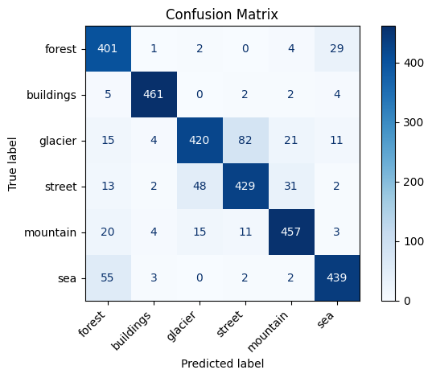

# Preprocesamiento y Organización del Dataset de Imágenes

Este proyecto tiene como objetivo desarrollar un modelo de red neuronal convolucional (CNN) para clasificar imágenes de escenas naturales utilizando el Intel Image Classification Dataset. Este conjunto de datos, disponible en Kaggle, contiene aproximadamente 25,000 imágenes de 150x150 píxeles divididas en seis categorías: buildings, forest, glacier, mountain, sea y street. El objetivo es entrenar, evaluar y optimizar un modelo CNN en TensorFlow/Keras, con un flujo de trabajo que incluye preprocesamiento, aumento de datos, entrenamiento, evaluación, visualización de resultados y la capacidad de guardar y reanudar el entrenamiento del modelo. El proyecto se implementó en Google Colab, utilizando imágenes almacenadas en Google Drive.

---

## ✅ Requisitos: Semana 2

### 📁 1. Generación o selección del set de datos

- Conjunto de datos: Se utilizó el Intel Image Classification Dataset, que contiene aproximadamente 25,000 imágenes organizadas en carpetas por clase: `buildings`, `forest`, `glacier`, `mountain`, `sea`, `street`.
- Organización: Las imágenes originalmente estaban divididas solo en carpetas de entrenamiento y prueba. Se realizó una **distribución manual** para crear la carpeta `valid/` (validación), siguiendo una proporción aproximada de 60% (entrenamiento), 20% (validación) y 20% (prueba) para cada clase. Así, la estructura final quedó organizada en carpetas `train/`, `valid/` y `test/`, cada una con subcarpetas por clase.

Cada carpeta contiene subcarpetas por clase.

---

## 🔧 Preprocesado de los datos

### 📐 Escalamiento

Se aplicó escalamiento a todas las imágenes dividiendo los valores de píxeles entre 255:

```python
rescale=1./255
```

Esto normaliza los valores de entrada al rango [0, 1], necesario para modelos de deep learning.

### 🔁 Aumentación de datos (solo entrenamiento)

Para mejorar la generalización del modelo y evitar overfitting, se aplicó data augmentation al conjunto de entrenamiento:

```python
train_datagen = ImageDataGenerator(
    rescale=1./255,
    rotation_range=20,
    width_shift_range=0.2,
    height_shift_range=0.2,
    shear_range=0.3,
    zoom_range=0.3,
    horizontal_flip=True
)
```

Esto genera versiones aumentadas de cada imagen en tiempo real durante el entrenamiento.

### 📂 Organización de carpetas esperada

El conjunto de datos se organiza en carpetas por clase, con subcarpetas para entrenamiento, validación y prueba. La estructura es la siguiente:

```bash
dataset-landmark/
├── train/
│   ├── buildings/
│   ├── forest/
│   ├── glacier/
│   ├── mountain/
│   ├── sea/
│   ├── street/
├── valid/
│   ├── buildings/
│   ├── forest/
│   ├── glacier/
│   ├── mountain/
│   ├── sea/
│   ├── street/
└── test/
    ├── buildings/
    ├── forest/
    ├── glacier/
    ├── mountain/
    ├── sea/
    ├── street/
```

---

## 🛠️ Modelo y Evaluación

### Arquitectura del Modelo
Se utilizó una red neuronal convolucional (CNN) para la clasificación de imágenes. La arquitectura del modelo se basa en capas convolucionales y densas, con funciones de activación ReLU y softmax.
Se utilizó la función de pérdida `categorical_crossentropy` y el optimizador `Adam`. La métrica de evaluación fue la precisión (`accuracy`).

### Arquitectura del modelo

```python
    model = Sequential()

    # # Conv block 1: 16 filtros
    model.add(Conv2D(16, (3,3), activation='relu', padding='same',
                            input_shape=input_shape))
    model.add(MaxPooling2D((2,2)))  # reduce a 40×40

    # Conv block 2: 32 filtros
    model.add(Conv2D(32, (3,3), activation='relu', padding='same'))
    model.add(MaxPooling2D((2,2)))  # reduce a 20×20

    # Conv block 3: 64 filtros
    model.add(Conv2D(64, (3,3), activation='relu', padding='same'))
    model.add(MaxPooling2D((2,2)))  # reduce a 10×10

    # Conv block 3: 64 filtros
    model.add(Conv2D(64, (3,3), activation='relu', padding='same'))
    model.add(MaxPooling2D((2,2)))  # reduce a 10×10
    
    # Conv block 3: 128 filtros
    model.add(Conv2D(128, (3,3), activation='relu', padding='same'))
    model.add(MaxPooling2D((2,2)))  # reduce a 10×10

    # Añadir Dropout para reducir overfitting
    model.add(Dropout(0.3))

    # Aplanar y capa de salida
    model.add(Flatten())
    model.add(Dense(num_classes, activation='softmax'))
```

- Capas convolucionales (Conv2D) con 32, 64 y 128 filtros, activación ReLU.
- Capas de agrupamiento (MaxPooling2D) para reducir dimensiones.
- Capa Flatten para aplanar las características.
- Capa de abandono (Dropout, 0.3) para prevenir sobreajuste.
- Capa de salida (Dense) con 6 neuronas y activación softmax para clasificación multiclase.

### Evaluación del modelo

Se utilizó el conjunto de validación para evaluar el rendimiento del modelo. Se reportaron métricas como precisión, recall y F1-score. La matriz de confusión se generó para visualizar el rendimiento del modelo en cada clase.

## Resultados

- Precisión del modelo: 0.869 (86.9%)
- Recall: 0.869 (86.9%)
- F1-score: 0.869 (86.9%)

- Matriz de confusión: Se generó una matriz de confusión para visualizar el rendimiento del modelo en cada clase.



## Entregable

1. Week 2: El archivo se encuentra en este repositorio, el enlace es el siguiente:
   - [Google Collab Notebook](https://github.com/DHurtado714-itesm/tc3002b/blob/main/data-processing.ipynb)
2. Week 3: El archivo se encuentra en este repositorio, el enlace es el siguiente:
   - [Google Collab Notebook](https://github.com/DHurtado714-itesm/tc3002b/blob/main/main.ipynb)